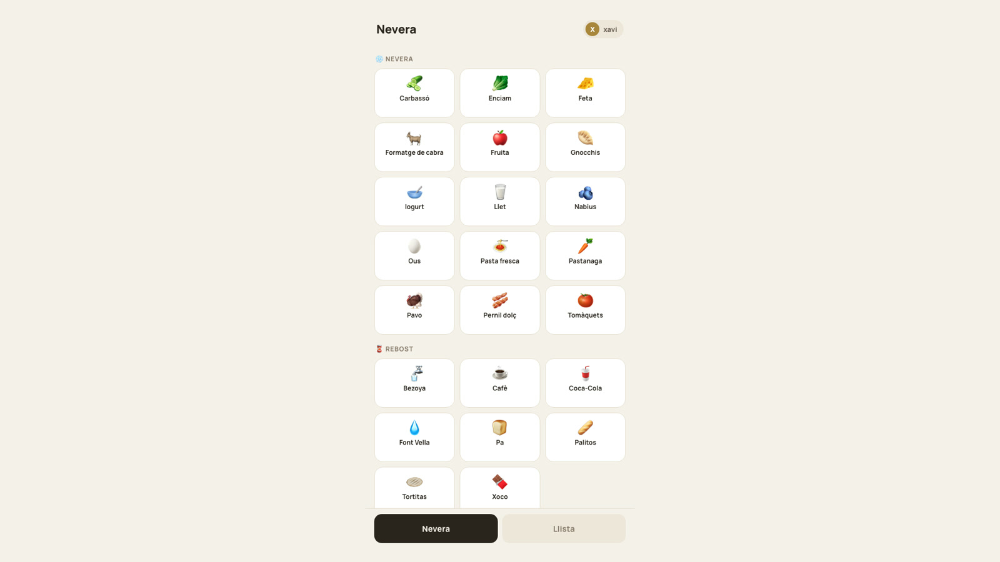
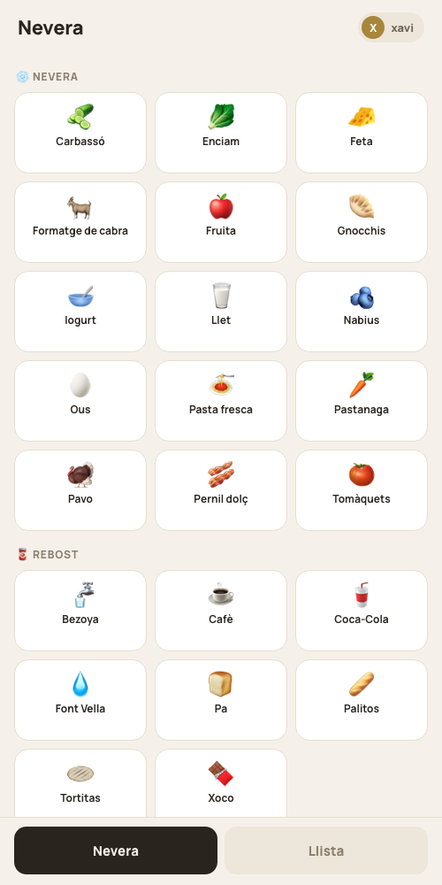

# Nevera Bosch



Shared family shopping list that starts at the place where the need appears: the fridge. An NFC sticker opens the PWA immediately and every phone sees the same list in real time.

## Real interface



## Product loop

Tap the NFC tag, unlock with a short household PIN, choose the person, add a frequent product with one tap and see the shared list update through Firestore. Local storage keeps the project useful without Firebase and persistent cache supports weak connectivity.

## Stack

Vite, React, installable PWA manifest, Firebase Firestore, Web Push, Vercel Functions and an NFC URL tag.

## Privacy and configuration

This public version contains generic demo people and no household identifier, PIN or Firebase credentials. Copy `.env.example` to `.env` and provide your own values. The fallback PIN is only for local demonstration.

## Run

```bash
npm install
cp .env.example .env
npm run dev
```

Without Firebase values the app uses local storage. For a shared deployment, configure Firestore and review `firestore.rules` before production use.

## What I learned

The physical context can be part of the interface. Removing installation, account creation and navigation mattered more than adding features. A family with full shopping bags is a demanding usability test.

## CA

Llista de compra familiar en forma de PWA. Un adhesiu NFC a la nevera obre la llista compartida i Firestore sincronitza tots els mòbils en temps real.

## ES

Lista de la compra familiar en forma de PWA. Una pegatina NFC en la nevera abre la lista compartida y Firestore sincroniza todos los móviles en tiempo real.
